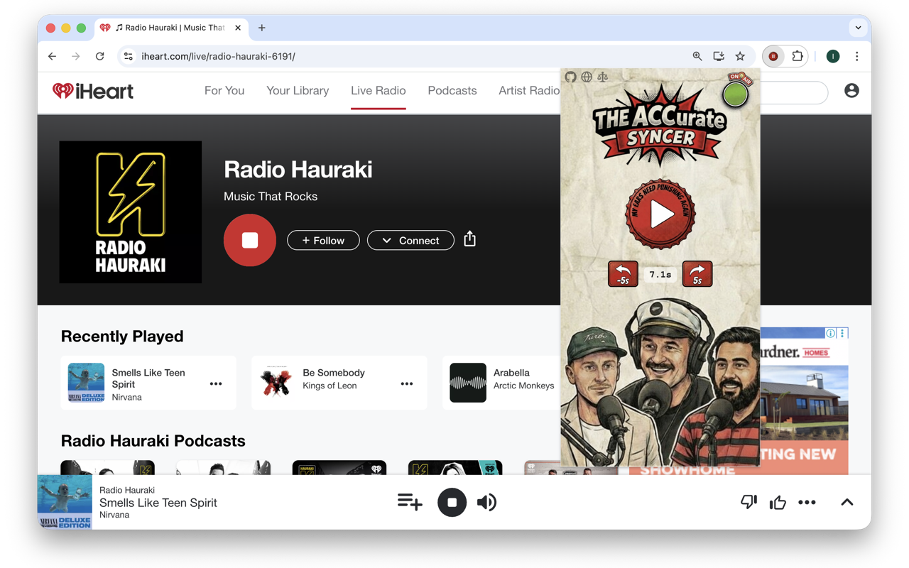

# The ACCurate Syncer

[Website](https://isaacmurtagh.github.io/the-accurate-syncer/)

Sky Sport streaming is a solid 20–60 seconds behind live radio. So the ACC calls tries before you've even seen the linebreak. This extension holds the iHeart Radio stream back so the commentary lines up with what's on your screen.

## How it works

Pause the audio, wait until commentary matches your TV picture, hit play. The stream rewinds by exactly how long you waited. Fine-tune with the ±5s buttons if needed.

## Install

- **Chrome:** [Chrome Web Store](https://chromewebstore.google.com/detail/the-accurate-syncer/ainlcejmepmgocacoicokopojiklogob)
- **Firefox:** [Firefox Add-ons](https://addons.mozilla.org/en-US/firefox/addon/the-accurate-syncer)

Then navigate to the ACC on [iHeart Radio](https://www.iheart.com/live/alternative-commentary-collective-6693/), hit play, and click the extension icon to sync away.

## Docs

[the-accurate-syncer](https://isaacmurtagh.github.io/the-accurate-syncer/)

## License

GPL-3.0 — see [LICENSE](LICENSE).

## Disclaimer

This is a fan-made project. Not affiliated with or endorsed by [The ACC](https://www.theaccnz.com/), [iHeartMedia](https://www.iheart.com), or [Sky Sport](https://www.sky.co.nz/discover/sky-sport).
